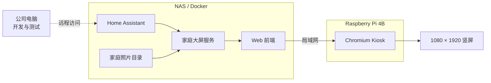
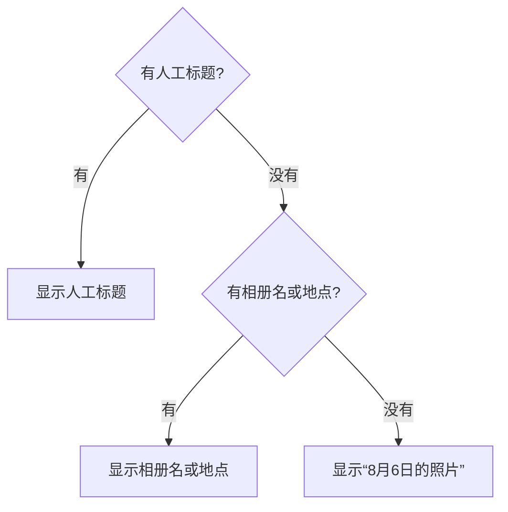

# 家庭大屏 MVP 实现计划

具体语言、代码结构、模块边界和扩展方式见：[技术实现方案.md](./技术实现方案.md)。

## 1. MVP 目标

做出一套可以长期运行的家庭大屏首版：

- NAS 通过 Docker 提供网页、Home Assistant 数据和家庭照片。
- Raspberry Pi 以竖屏 Kiosk 模式显示网页。
- 三个页面可以使用真实数据运行。

MVP 的重点是验证“每天是否愿意看、信息是否清楚、页面切换是否顺畅”，不是一次做完所有设想。

## 2. MVP 范围

### 本期实现

- `Home / Light`
  - 时间、日期、天气
  - 今日待办：从家庭备忘清单中筛选日期为今天的未完成事项
  - 4～6 条家庭备忘
  - 6～8 条购物清单
  - 页面最下方展示一张最近照片
- `Status / Light`
  - 首批房间的温度、湿度和少量设备状态
- `Photos / Light`
  - NAS 照片轮播
  - 按拍摄日期生成标题
  - 最近照片缩略图
- 键盘和触摸/鼠标切页
- NAS Docker 部署
- Raspberry Pi 开机自动进入大屏

### 本期不实现

- ESP32-S3 语音
- STM32 + ToF 靠近检测和手势
- AI 自动识别“公园散步”等照片内容
- 大量智能家居控制按钮
- 用户账号、外网访问和多家庭支持
- 手机端管理应用

## 3. 整体架构



开发阶段在公司电脑上进行。Home Assistant 使用安全的远程连接；NAS 照片如果无法远程访问，先用本地模拟目录开发。最终服务部署到家中 NAS，Pi 只负责显示。

## 4. 数据来源

| 页面内容 | MVP 数据来源 | 更新方式 |
|---|---|---|
| 时间、日期 | 浏览器本地时间 | 每分钟 |
| 天气 | Home Assistant 天气实体 | 定时刷新 |
| 今日待办 | 从 HA 家庭备忘清单中筛选日期为今天的未完成事项 | 定时刷新 |
| 家庭备忘 | HA 中单独的待办清单 | 定时刷新 |
| 购物清单 | HA 购物/待办清单 | 定时刷新 |
| 房间状态 | 指定的 HA 传感器和设备实体 | 定时刷新 |
| 家庭照片 | NAS 指定的只读照片目录 | 后端每小时扫描一次并更新索引 |
| 照片标题 | EXIF 拍摄日期；没有则用文件时间 | 建立索引时生成 |

照片标题采用以下回退顺序：



首版只保证日期标题。以后可以增加离线或云端 AI 描述，但生成后应保存结果，不在展示时实时识别。

## 5. 服务边界

### NAS：家庭大屏服务

职责：

- 托管前端静态文件。
- 读取 Home Assistant 数据并整理成大屏需要的格式。
- 只读扫描照片目录。
- 生成和缓存照片缩略图。
- 提供健康状态，便于判断 HA 或照片目录是否不可用。

建议首版只提供少量接口：

```text
GET /api/v1/dashboard
GET /api/v1/status
GET /api/v1/photos
GET /api/v1/health
GET /media/...
```

Home Assistant 的具体接口、实体映射和刷新周期在开发联调时进一步确认。

配置通过环境变量和一个配置文件完成，不在首版开发后台管理页面。

### Raspberry Pi：显示与硬件适配

职责：

- Chromium 全屏显示 NAS 上的 Web 前端。
- 开机自动启动并打开 NAS 提供的网页。

### 公司电脑：开发环境

职责：

- 开发和测试 Web 前端、API 与 Docker 镜像。
- UI 开发先使用模拟数据，避免依赖家庭网络状态。
- 通过远程地址接入家中 Home Assistant 做真实数据联调。
- NAS 照片不可远程访问时，使用结构相同的本地测试目录。

Home Assistant 地址和访问令牌只通过本机环境变量注入，不写入代码、配置样例或 Git。

## 6. 实施阶段

### 阶段 A：前端原型

- 建立 Web 项目和三个页面。
- 按 Penpot 设计实现 1080 × 1920 布局。
- 使用本地模拟数据。
- 支持键盘和触摸/鼠标切页。
- 在实际 21.5 英寸竖屏上检查字号和信息密度。

完成标准：四个页面可连续运行和切换，主要文字在 1～3 米距离可读。

### 阶段 B：NAS 最小服务

- 建立家庭大屏 Docker Compose 项目。
- 托管前端和 API。
- 提供模拟版 `/api/v1/dashboard`、`/api/v1/status` 和 `/api/v1/photos`。
- 加入 Docker 健康检查和持久化配置目录。

完成标准：局域网设备打开一个 NAS 地址即可看到大屏。

### 阶段 C：接入 Home Assistant

- 创建长期访问凭据并通过 Docker Secret 或环境变量注入。
- 建立实体映射配置，不把实体 ID 写死在页面代码中。
- 接入天气、今日待办、备忘、购物清单和首批房间状态。
- 处理 HA 离线、实体不存在和数据为空。

### 阶段 D：接入 NAS 照片

- 以只读方式挂载一个照片目录到容器。
- 读取 JPEG、PNG 和 WebP。
- 使用 EXIF 时间排序；缺少 EXIF 时使用文件修改时间。
- 每小时扫描一次照片目录并更新索引。
- 生成缩略图缓存，避免每次加载原始大图。
- 相册页自动轮播，首页展示最近照片。

完成标准：新增照片在下一次每小时扫描后进入索引，并可在相册页正常显示。

### 阶段 E：Pi 部署与试运行

- 设置 1080 × 1920 竖屏方向。
- 配置 Chromium Kiosk 和开机自启。
- 隐藏鼠标、关闭浏览器提示和系统通知。
- 由项目负责人直接确认最终部署效果。

## 7. MVP 验收清单

- [x] 首页展示真实天气、今日事项高亮、备忘、购物清单和最近照片。
- [x] 天气页展示 HA 实时天气、逐小时和每日预报。
- [x] 状态页展示首批真实房间数据。
- [x] 相册页可以稳定轮播已索引照片。
- [x] 照片没有人工标题时使用日期标题，不生成不可靠描述。
- [x] 键盘和触摸/鼠标均能切换四页。
- [ ] 主要信息在正常家庭观看距离内清晰可读。

## 8. 开工前只需确认的配置

1. NAS 照片目录路径，以及允许扫描的子目录范围。
2. Home Assistant 中天气、备忘、购物清单和房间状态对应的实体；具体接口在开发联调时确认。
3. 首版需要展示的房间名称。
4. 公司电脑访问家中 Home Assistant 的远程方式。
5. 公司电脑是否可以远程访问 NAS 照片目录。

这些配置可以逐项补充，不影响先开始阶段 A 和阶段 B。
