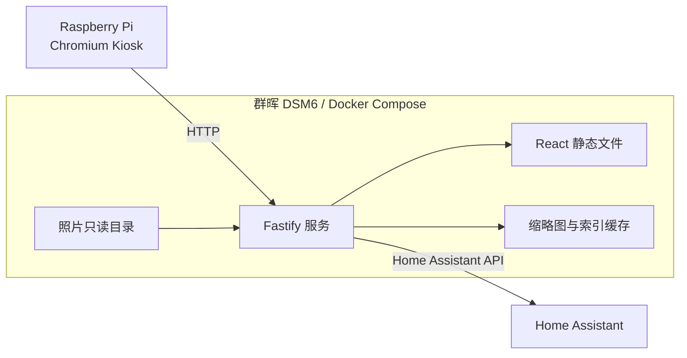
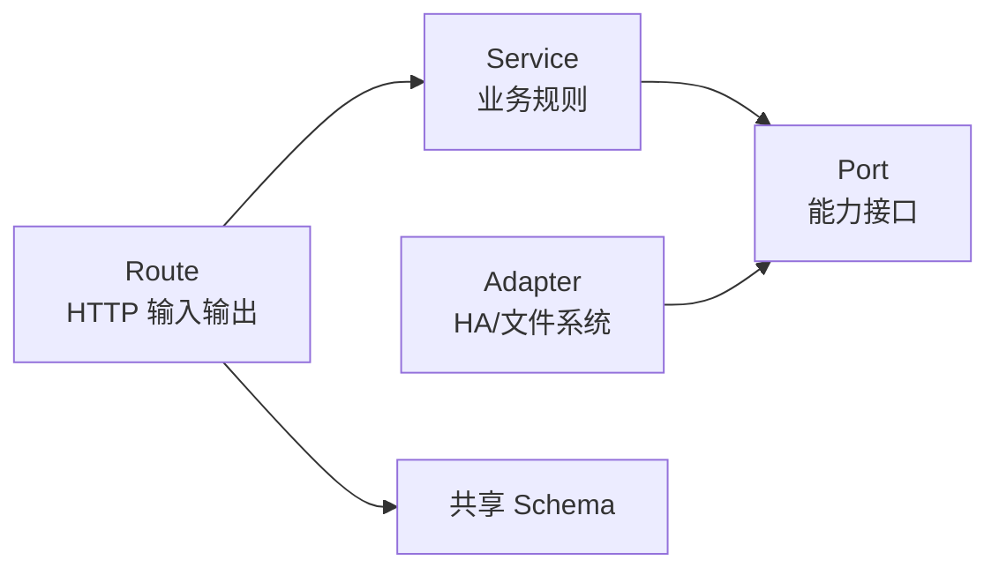

# 家庭大屏技术实现方案

## 1. 技术选型结论

> 视觉实现的唯一依据是当前 Penpot 文件中的 `Home / Light`、`Status / Light` 和 `Photos / Light` 三个画板。本方案不引入其他 UI/UX 风格、组件主题、配色方案、字体方案或布局规范。技术选型只解决代码组织、数据和部署问题，不改变设计。

前后端统一使用 **TypeScript**，采用以下技术组合：

公司电脑的开发、测试和生产构建只使用 Node.js 与 npm，不要求安装或运行 Docker。Docker 相关文件仅用于最终群晖 NAS 部署。

| 部分 | 选择 | 用途 |
|---|---|---|
| Web 前端 | React + Vite | 三个大屏页面、切页和数据展示 |
| 页面路由 | React Router | 每个页面使用独立 URL，便于增加新页面 |
| 服务端 | Node.js LTS + Fastify | 调用 Home Assistant、扫描照片、提供 API 和静态网页 |
| 数据校验 | Zod | 前后端共享接口结构，并校验 HA、配置和 API 数据 |
| 前端样式 | CSS Modules + CSS Variables | 精确还原 Penpot，隔离组件样式并统一设计变量 |
| 测试 | Vitest + React Testing Library | 业务逻辑、接口转换和关键页面测试 |
| 端到端测试 | Playwright | 检查 1080 × 1920 页面、切页和异常数据 |
| 部署 | Docker + Docker Compose | 部署到群晖 DSM6 |

生产环境使用当前受支持的 Node.js LTS 版本，不使用 Current 或已经 EOL 的版本。开始实现时将具体版本锁定在项目文件和 Dockerfile 中。

### 为什么统一使用 TypeScript

- 页面、API 和数据结构只维护一套类型。
- 家庭大屏主要是 Web 与 HTTP 集成，Node.js 足以承担当前负载。
- 后续新增页面、Home Assistant 数据源、语音或硬件输入时，可以继续沿用同一套模块接口。
- 相比前端 TypeScript、后端 Python 的组合，开发、构建和维护更简单。

### 为什么不用 Next.js

这个项目是局域网中的长期运行大屏，不需要 SEO、服务端渲染、账号系统或公网内容分发。React SPA 加独立 API 更直接，产物更小，部署关系也更清楚。

### 为什么使用 CSS Modules

当前已经有 Penpot 画板，需要精确控制固定竖屏布局。CSS Variables 用于颜色、字号、间距等全局设计变量，CSS Modules 用于页面和组件的局部样式，避免后续页面之间相互污染。

不使用带默认视觉风格的 UI 组件库。所有可见属性，包括位置、尺寸、颜色、字体、字号、字重、行高、圆角、边框、阴影、间距和图片裁切方式，都从 Penpot 节点读取。

## 2. 总体运行结构



MVP 可以由一个服务端进程同时提供 API、媒体文件和构建后的 React 静态文件。源码边界保持独立，将来有实际需要时，可以把 Web、API 或照片任务拆成多个容器，不影响业务代码。

## 3. 仓库目录结构

使用 npm workspaces 管理一个小型 monorepo：

```text
家庭屏/
├─ apps/
│  ├─ web/                         # React 大屏前端
│  │  ├─ src/
│  │  │  ├─ app/                   # 应用入口、路由和全局 Provider
│  │  │  ├─ pages/                 # 页面模块
│  │  │  │  ├─ home/
│  │  │  │  ├─ status/
│  │  │  │  └─ photos/
│  │  │  ├─ widgets/               # 可复用的大块界面
│  │  │  ├─ components/            # 基础 UI 组件
│  │  │  ├─ services/              # API 客户端
│  │  │  ├─ hooks/                 # 通用 React hooks
│  │  │  └─ styles/                # 设计变量和全局样式
│  │  └─ public/
│  │
│  └─ server/                      # Fastify 服务端
│     └─ src/
│        ├─ app/                   # 服务创建、插件注册和启动
│        ├─ modules/               # 业务模块
│        │  ├─ dashboard/
│        │  ├─ status/
│        │  ├─ photos/
│        │  └─ health/
│        ├─ integrations/          # 外部系统适配器
│        │  └─ home-assistant/
│        ├─ infrastructure/        # 文件、缓存、定时任务和日志
│        └─ config/                # 环境变量与实体映射读取
│
├─ packages/
│  ├─ contracts/                   # API Schema、共享类型和枚举
│  └─ test-data/                   # 前后端共用的固定测试数据
│
├─ config/
│  └─ entities.example.yaml        # 不包含令牌的实体映射示例
├─ docker/
│  └─ entrypoint.sh
├─ tests/
│  └─ e2e/                         # Playwright 测试
├─ docker-compose.yml
├─ Dockerfile
├─ package.json
└─ .env.example
```

不要按“所有组件”“所有接口”分别堆在单个大目录中。页面相关内容放在对应页面模块里；只有被两个以上页面稳定复用的内容，才上移到 `widgets`、`components` 或共享包。

### 3.1 构建与类型检查

Vite 只负责转译前端 TypeScript，生产构建前必须单独运行完整类型检查。根目录脚本至少包含：

```json
{
  "scripts": {
    "typecheck": "npm run typecheck --workspaces --if-present",
    "test": "vitest run",
    "build": "npm run typecheck && npm run build -w @family-display/contracts && npm run build -w @family-display/web && npm run build -w @family-display/server"
  }
}
```

每个 TypeScript workspace 提供自己的 `typecheck` 脚本并使用 `tsc --noEmit`。CI 或正式 Docker 构建必须执行根目录 `build`，不能只运行 `vite build`。

## 4. 前端模块设计

### 4.1 页面注册机制

所有页面通过一个页面注册表接入：

```ts
export interface DisplayPageDefinition {
  id: string;
  path: string;
  title: string;
  order: number;
  enabled: boolean;
  component: React.ComponentType;
}
```

首版注册：

```text
/            Home / Light
/status      Status / Light
/photos      Photos / Light
```

新增页面时只需：

1. 在 `pages` 下增加一个页面模块。
2. 注册路径、标题和排序。
3. 如果需要新数据，再增加对应服务端模块和契约。

三个 MVP 页面体积较小，首版直接加载，避免第一次切页时出现空白。后续新增体积较大的页面时，再通过同一注册表配置懒加载。

服务端必须支持 SPA 路由回退，保证 Pi 直接打开或刷新 `/status`、`/photos` 时不会出现 404。匹配顺序固定为：

```text
/api/v1/*  → API 路由，不匹配时返回 JSON 404
/media/*   → 照片路由，不匹配时返回 404
/assets/*  → 构建后的静态资源
其他 GET   → web/dist/index.html
```

### 4.2 页面模块内部结构

以首页为例：

```text
pages/home/
├─ HomePage.tsx
├─ HomePage.module.css
├─ home.model.ts
├─ home.mapper.ts
└─ widgets/
   ├─ ClockWeather/
   ├─ TodayTodos/
   ├─ FamilyMemos/
   ├─ ShoppingList/
   └─ RecentPhoto/
```

页面只负责排列模块，不直接调用 Home Assistant，也不处理原始 API 字段。数据获取集中在页面 model/hook 中，显示组件只接收已经整理好的 props。

### 4.3 UI 基础组件

首版只建立实际需要的组件：

- `PageShell`：1080 × 1920 画布、背景和安全边距。
- `Card`：统一白色卡片、圆角和内边距。
- `SectionHeader`：模块标题与数量。
- `StatusBadge`：正常、提醒、异常状态。
- `EmptyState`：无待办、无照片或无状态数据。
- `LoadingState`：初次加载占位。
- `ErrorState`：模块级错误，不让整页白屏。
- `PhotoFrame`：统一照片裁切与占位。

不提前建立庞大的通用组件库。组件真正复用后再抽象。

### 4.4 固定画布与显示缩放

Penpot 画板尺寸固定为 1080 × 1920。网页内部始终使用这一设计坐标系，外层容器根据 Chromium 实际 viewport 等比缩放：

```ts
const DESIGN_WIDTH = 1080;
const DESIGN_HEIGHT = 1920;
const scale = Math.min(
  window.innerWidth / DESIGN_WIDTH,
  window.innerHeight / DESIGN_HEIGHT,
);
```

- 设计画布保持 `1080px × 1920px`，不因屏幕尺寸重新排版。
- 使用 `transform: scale(...)` 等比缩放，并以左上角为变换原点。
- 缩放后的画布在 viewport 中水平、垂直居中。
- 页面禁止滚动，画布以外区域使用 Penpot 页面背景色。
- 启动时记录 `innerWidth`、`innerHeight` 和 `devicePixelRatio`，便于排查 Pi 显示缩放问题。
- 浏览器窗口变化时重新计算缩放比例。

### 4.5 设计变量

将 Penpot 中重复出现且数值相同的视觉属性整理为 CSS Variables，例如：

```css
:root {
  --penpot-color-page-background: /* 从 Penpot 读取 */;
  --penpot-color-card-background: /* 从 Penpot 读取 */;
  --penpot-color-text-primary: /* 从 Penpot 读取 */;
  --penpot-radius-card: /* 从 Penpot 读取 */;
  --penpot-page-padding-x: /* 从 Penpot 读取 */;
}
```

不根据截图目测或自行选择近似值。实现时通过 Penpot MCP 读取节点属性，并将读取结果记录到代码中的 token 文件。只有 Penpot 中确实重复的数值才提取为公共变量；页面特有值保留在页面样式中。

### 4.6 Penpot 还原流程

每个画板按同一流程实现：

1. 读取画板的节点树、层级、绝对位置和尺寸。
2. 读取所有文字的字体、字号、字重、行高、颜色和对齐方式。
3. 读取卡片的填充、圆角、边框、阴影和间距。
4. 导出整个画板作为视觉基准图。
5. 按 Penpot 层级建立 React 页面和组件，不自行重排内容。
6. 使用 1080 × 1920 浏览器 viewport 截图。
7. 将网页截图与 Penpot 导出图逐页对照并修正。

Penpot 没有定义的加载、空数据和错误状态，先使用最小文字占位，并保持所在模块原有尺寸和视觉语言；不擅自增加新的卡片、颜色、图标或装饰。需要形成正式新状态时，先补充 Penpot 设计再实现。

字体不能只依赖开发电脑或 Pi 的系统字体。实现每个页面时必须从 Penpot 确认字体、字重和中文回退字体；允许随项目分发的字体以本地 WOFF2 文件随网页提供，不能分发的字体则记录为 Pi 部署依赖。开发截图与 Pi 必须加载同一套字体。

动态内容必须限制在 Penpot 已有文本框和卡片尺寸内，不允许内容自动撑高卡片或改变后续模块位置。实现时根据各文本框确定最大行数并使用截断或省略号；列表只展示 MVP 规定的最大条数，完整原始数据仍保留在数据层。具体行数根据对应 Penpot 节点在实现页面时逐项记录。

### 4.7 大屏交互

- 路由 URL 是页面状态的唯一来源。
- 支持左右滑动、鼠标拖动和键盘左右键切页。
- 不新增 Penpot 中不存在的悬浮视觉、转场动画或操作提示。
- 切页输入统一进入 `NavigationController`，将来 ToF 或语音只需增加新的输入适配器。

```ts
export interface NavigationInput {
  start(onCommand: (command: NavigationCommand) => void): void;
  stop(): void;
}
```

首版实现 `KeyboardInput` 和 `PointerSwipeInput`；后续可增加 `TofInput`、`VoiceInput`，页面无需知道命令来自哪里。

## 5. 服务端模块设计

服务端每个业务模块遵循相同结构：

```text
modules/dashboard/
├─ dashboard.route.ts       # HTTP 路由
├─ dashboard.service.ts     # 用例编排
├─ dashboard.mapper.ts      # 外部数据转为领域数据
├─ dashboard.types.ts       # 模块内部类型
└─ dashboard.test.ts
```

### 5.1 分层职责



- `route`：解析请求、调用 service、返回响应。
- `service`：实现“今日待办”“照片排序”等业务规则。
- `port`：声明业务需要什么能力，不绑定具体系统。
- `adapter`：负责调用 HA、读取文件或生成缩略图。
- `contract`：定义客户端能够收到的数据结构。

### 5.2 Home Assistant 适配器

先定义能力接口，再决定具体 HA API：

```ts
export interface HomeAssistantGateway {
  getWeather(): Promise<WeatherSnapshot>;
  getMemoItems(): Promise<MemoItem[]>;
  getShoppingItems(): Promise<ShoppingItem[]>;
  getEntityStates(entityIds: string[]): Promise<EntityState[]>;
}
```

HA 待办的到期值必须区分“仅日期”和“带时间日期”，不能把二者统一转换为 UTC 时间：

```ts
export type TodoDue =
  | { kind: 'date'; value: string }       // 例如 2026-08-12
  | { kind: 'datetime'; value: string };  // 带时区的 ISO 8601
```

家庭时区通过 `APP_TIMEZONE` 配置，默认 `Asia/Hong_Kong`。`date` 按家庭时区中的日历日期直接比较；只有 `datetime` 需要转换到家庭时区后判断是否为今天。

今日待办规则放在 `dashboard.service.ts`，不放在 HA 适配器中：

```text
家庭备忘原始事项
  → 排除已完成
  → 将日期转换为家庭时区
  → 保留日期为今天的事项
  → 按时间和原始顺序排序
  → 返回今日待办
```

这样以后备忘来源改变，今日待办规则仍可复用。

### 5.3 照片模块

首版保持简单：

1. 服务启动时扫描一次照片目录。
2. 此后每小时扫描一次。
3. 支持 JPEG、PNG 和 WebP。
4. 优先读取 EXIF 拍摄时间，没有则使用文件修改时间。
5. 生成列表和缩略图。
6. 将索引写到可写缓存目录，照片源目录保持只读。

```ts
export interface PhotoRecord {
  id: string;
  mediaUrl: string;
  thumbnailUrl: string;
  capturedAt: string;
  title: string;
}
```

使用进程内定时任务即可，不引入 Redis、消息队列或独立任务服务。扫描间隔使用配置项，默认 `60` 分钟。

照片索引使用“相对路径、文件大小、修改时间”判断文件是否变化，未变化的文件复用原缩略图。媒体接口只接收后端生成的不透明 `photoId`，再通过索引查找实际路径；禁止把请求参数直接拼接为文件路径，并拒绝解析到照片根目录以外的文件或符号链接。

### 5.4 配置

配置分两类：

- Secret：`HA_BASE_URL`、`HA_TOKEN`，仅通过环境变量或 Docker Secret 注入。
- 普通配置：`APP_TIMEZONE`、实体 ID、房间名称、照片扫描范围，放在环境变量或 YAML 配置文件中。

启动时使用 Zod 校验全部配置。配置错误时输出明确错误并拒绝启动，避免运行后才出现隐蔽空数据。

## 6. API 契约

API 使用 `/api/v1` 前缀，为以后调整保留空间：

```text
GET /api/v1/dashboard
GET /api/v1/status
GET /api/v1/photos
GET /api/v1/health
GET /media/original/:photoId
GET /media/thumbnail/:photoId
```

统一响应外壳：

```ts
interface ApiEnvelope<T> {
  data: T;
  meta: {
    generatedAt: string;
    mode: 'live' | 'mock';
  };
}

type SectionResult<T> =
  | { status: 'ready'; data: T; updatedAt: string }
  | { status: 'empty'; data: null; updatedAt: string | null }
  | {
      status: 'unavailable';
      data: null;
      updatedAt: string | null;
      reason: 'source_unavailable' | 'invalid_source_data' | 'not_configured';
    };
```

Dashboard 和 Status 中的天气、今日待办、备忘、购物和房间状态等字段分别使用 `SectionResult<T>`。某个来源失败时，该 section 返回 `unavailable`，其他 section 仍然正常返回。只有整个接口无法生成合法响应时才返回 5xx。

除 `TodoDue.kind === 'date'` 的仅日期值外，接口中的日期时间统一使用带时区的 ISO 8601 字符串。前端只负责格式化显示，不自行猜测服务端时区。

`packages/contracts` 中使用 Zod 定义 schema，再从 schema 推导 TypeScript 类型。服务端返回前校验，前端接收后也校验，防止联调时静默接受错误字段。

生产环境中网页、API 和媒体文件使用同一个 NAS 地址，浏览器只访问相对路径 `/api/v1/...` 和 `/media/...`，不启用跨域。开发环境由 Vite 将这两个前缀代理到本地 Fastify。HA Token 始终只存在于服务端，不能进入前端环境变量或构建产物。

## 7. 模拟数据策略

模拟数据与真实数据使用同一契约：

```text
DashboardDataSource
├─ MockDashboardDataSource
└─ ApiDashboardDataSource
```

通过环境配置决定使用哪个数据源。页面组件不能出现 `if (mock)` 分支。这样阶段 A 完成的页面在接入真实 API 时只替换数据源，不重写 UI。

所有固定模拟数据只保存在 `packages/test-data`，前端 mock 数据源、服务端测试和 Playwright 均从这里读取，不在页面目录中复制另一份。

需要准备以下固定场景：

- 正常完整数据。
- 今日无待办。
- 列表内容达到上限。
- 某个模块无数据。
- 超长中文标题。
- API 返回部分数据。
- 照片为空。

## 8. 数据刷新

具体 HA 接口在联调时确定，但代码先保留统一刷新策略：

- 浏览器时间：本地每分钟更新。
- Dashboard 和 Status：前端按配置间隔轮询。
- Photos：前端定时重新获取索引；服务端每小时扫描照片目录。
- 同一请求正在进行时不重复发起。
- 页面切到后台时降低或暂停刷新，恢复可见后立即刷新一次。

首版不引入 WebSocket。轮询足以满足家庭大屏的信息更新速度；将来确实需要实时状态时，再在数据层增加推送实现。

## 9. 状态与错误处理

每个页面按模块展示状态，不能因为一个数据源失败导致整页不可用：

```ts
type ModuleState<T> =
  | { status: 'loading' }
  | { status: 'ready'; data: T }
  | { status: 'empty' }
  | { status: 'error'; message: string };
```

前端数据层将服务端的 `SectionResult.ready/empty/unavailable` 映射为 `ModuleState.ready/empty/error`；`loading` 只表示浏览器尚未收到首次结果。映射逻辑集中在 service/model 层，不放进显示组件。

服务端日志记录请求、HA 调用和照片扫描结果，但不得记录 HA Token。日志使用结构化 JSON，便于通过 Docker 日志查看。

## 10. Docker 与 DSM6

- 使用多阶段 Dockerfile：第一阶段构建前端和服务端，第二阶段只放运行产物。
- Compose 中挂载：配置目录、只读照片目录、可写缓存目录。
- 不依赖较新的 Compose 专属语法，优先兼容 DSM6 上现有的 Docker Compose。
- 构建前确认 NAS CPU 架构，构建对应的镜像平台。
- 图像库包含原生依赖时，优先使用 Debian slim 基础镜像，降低群晖环境中的兼容问题。
- 部署阶段再确认 `docker version`、`docker-compose version` 和 NAS CPU 架构；在确认前不使用 `include`、`profiles`、较新的 `depends_on.condition` 等新语法。

建议挂载：

```text
/volume1/family-display/config  → /app/config          只读
/volume1/photos                 → /app/photos          只读
/volume1/family-display/cache   → /app/cache           可写
```

实际群晖目录由部署时确认。

## 11. 测试结构

### 单元测试

- 今日待办筛选和排序。
- EXIF 日期标题回退。
- 房间实体映射。
- Zod 配置与响应校验。
- 照片格式过滤。

### 组件测试

- 列表为空、正常、达到上限和超长文本。
- 页面模块加载和错误状态。
- 键盘与触摸切页命令。

### API 测试

- 使用假的 `HomeAssistantGateway`，不依赖真实家庭网络。
- 验证接口状态码和完整响应契约。

### 端到端测试

- 使用 1080 × 1920 viewport 截图对照 Penpot。
- 截图使用固定的模拟时间、天气、列表和照片，并暂停照片轮播等动态变化。
- 截图前等待本地字体加载完成。
- 三个 URL 可直接打开。
- 键盘、鼠标拖动和触摸滑动可以切页。
- 模拟无数据时页面不空白、不溢出。

## 12. 后续扩展方式

### 新增页面

增加页面模块、路由注册和必要的数据契约，不修改已有页面。

### 新增 Home Assistant 能力

在 `HomeAssistantGateway` 增加能力，或为较大的领域建立新 gateway；原始 HA 字段始终在 adapter 层转换。

### 增加 ToF

在 Pi 侧增加一个独立输入桥接程序，将手势转换为统一导航命令；Web 页面继续使用 `NavigationController`。ToF 不进入当前 MVP。

### 增加语音

语音服务将识别结果转换为页面导航或业务命令，通过独立输入通道传给网页或服务端。语音不直接操作 React 组件。

### 增加管理功能

如果以后需要配置房间、实体或照片标题，单独增加管理页面和写接口。展示端默认保持只读，不把管理逻辑混入大屏页面。

## 13. 开发顺序

### 第 1 步：工程骨架

- 创建 npm workspace。
- 建立 `web`、`server` 和 `contracts`。
- 配置 TypeScript、ESLint、测试和统一脚本。
- 建立 Dockerfile 与 Compose 骨架。

### 第 2 步：共享契约与模拟数据

- 定义 Dashboard、Status、Photos 和 Health schema。
- 建立固定模拟场景。
- 建立模拟 API。

### 第 3 步：三个前端页面

- 通过 Penpot MCP 读取三个画板的精确属性并提取重复设计变量。
- 实现基础组件和三个页面。
- 实现路由、键盘、鼠标和触摸切页。
- 对照 Penpot 导出图完成 1080 × 1920 逐页截图检查。

### 第 4 步：服务端模块

- 实现 Fastify 服务和静态文件托管。
- 实现业务模块、配置加载与健康接口。
- 前端切换到真实本地 API。

### 第 5 步：Home Assistant 联调

- 确定实际 API 和实体映射。
- 实现 HA adapter。
- 接入天气、今日待办、备忘、购物和房间状态。

### 第 6 步：照片与群晖部署

- 实现启动扫描和每小时扫描。
- 实现缩略图与媒体接口。
- 构建 NAS 架构对应的镜像并部署。
- 配置 Pi Chromium Kiosk 打开 NAS 网页。

## 14. 首版刻意不引入的内容

- Next.js 或服务端渲染。
- 数据库、Redis、消息队列和微服务。
- WebSocket 实时推送。
- 全局复杂状态库。
- 大型通用 UI 组件库。
- 后台管理系统。
- ToF 和语音代码。

这些能力在出现明确需求后再加入，当前模块边界已经为它们保留扩展位置。
