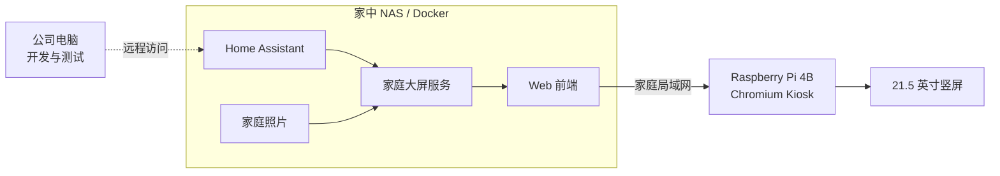

# 家庭大屏项目背景与交接

## 一句话说明

使用 21.5 英寸 1080 × 1920 竖屏和 Raspberry Pi 4B 制作明亮风格的家庭公告板；Home Assistant、照片和项目后端都放在家中 NAS 上运行，日常开发在公司电脑完成。

## 已有条件

- Raspberry Pi 4B
- 21.5 英寸左右的竖屏方案，目标分辨率为 1080 × 1920
- 家庭 NAS
- Home Assistant 已在 NAS 上运行
- 家庭照片保存在 NAS
- 公司电脑可以远程访问家中的 Home Assistant
- ESP32-S3 开发板
- STM32 + ST 8×8 ToF

## 已确定的架构

- NAS：运行 Home Assistant、家庭大屏 Docker 服务并保存照片。
- 公司电脑：开发前端、后端和 Docker；可远程连接 HA 做真实数据联调。
- Raspberry Pi：只作为显示终端。
- ToF：不进入 MVP，后续再直连 Raspberry Pi。
- ESP32-S3 语音：不进入 MVP，后续开发。

## MVP 页面

### 首页 `Home / Light`

当前顺序：

1. 时间、日期和天气
2. 今日待办
3. 家庭备忘（4～6 条）
4. 购物清单（6～8 条）
5. 家庭照片（位于页面最下方）

首页不展示普通家庭状态，不常驻语音或手势说明。

### 家庭状态 `Status / Light`

- 全屋概览
- 首批房间的温度、湿度和少量设备状态
- 少量快捷场景

### 家庭相册 `Photos / Light`

- 一张大照片轮播
- 最近照片/本周回忆缩略图
- 首版使用 EXIF 日期生成可靠标题，例如“8月6日的照片”
- 不自动声称“公园散步”等照片内容

照片标题回退顺序：人工标题 → 已有相册名/地点 → 拍摄日期。

## 视觉方向

- 明亮、干净、温暖的家居风格
- 米白背景、白色卡片、柔和蓝色主色
- 深灰文字；红/橙表示提醒，绿色表示正常
- 针对 1～3 米距离观看，字号要明显大于普通手机界面
- 旧深色控制台方案已经作废

## 设计资料现状

### Penpot

当前连接过的 Penpot 文件中，`Page 1` 已重建三个 1080 × 1920 可编辑画板：

- `Home / Light`
- `Status / Light`
- `Photos / Light`

- 链接：https://design.penpot.app/#/workspace?team-id=81f57451-85cc-819d-8008-786d0ee1488f&file-id=81f57451-85cc-819d-8008-78749ac20a8f&page-id=81f57451-85cc-819d-8008-78749ac20a90&board-id=5a88ffee-eb62-803e-8008-7875c5900f0a

可以通过mcp直接读写

## MVP 数据来源

| 内容 | 来源 |
|---|---|
| 时间与日期 | 浏览器本地时间 |
| 天气 | Home Assistant |
| 今日待办 | 从 HA 家庭备忘清单中筛选日期为今天的未完成事项 |
| 家庭备忘 | HA 中单独的待办清单 |
| 购物清单 | HA 购物/待办清单 |
| 房间状态 | 指定的 HA 传感器和设备实体 |
| 家庭照片 | NAS 中只读挂载的照片目录 |
| 照片标题 | EXIF 拍摄日期，缺失时使用文件时间 |

## 开发方式

1. 公司电脑先用模拟数据完成三个 Web 页面。
2. 公司电脑通过远程 HA 地址进行真实数据联调。
3. 如果无法远程读取 NAS 照片，先用本地测试照片目录。
4. 前端和 API 打包为 Docker 服务，最终部署到家中 NAS。
5. Raspberry Pi 设置为开机自动打开 NAS 上的页面。

安全要求：HA 地址和令牌通过本机环境变量或 Secret 注入，不提交到 Git，不写入项目文档。

## MVP 不包含

- ToF 靠近检测、手势和跟手动画
- ESP32-S3 语音
- AI 自动生成照片内容描述
- 手机管理端
- 大量设备控制功能
- 外网公开访问

## 建议的下一步

直接开始前端原型：建立 Web 项目，以模拟数据实现三个页面和键盘/触摸切页，然后再建立最小 Docker API。

完整实施步骤和验收标准见：[MVP实现计划.md](./MVP实现计划.md)。

技术选型、代码结构和模块化设计见：[技术实现方案.md](./技术实现方案.md)。

## 已知

- NAS 是群晖 DSM6，支持 Docker Compose
- NAS 照片目录后续由 Docker 只读映射
- 先按本地模拟方案开发
