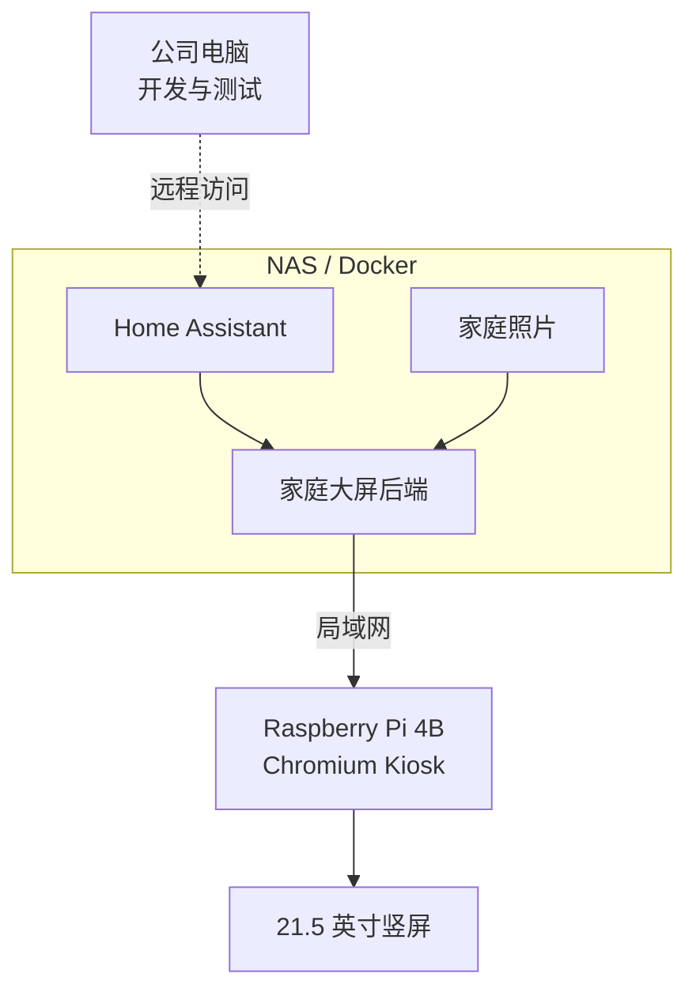
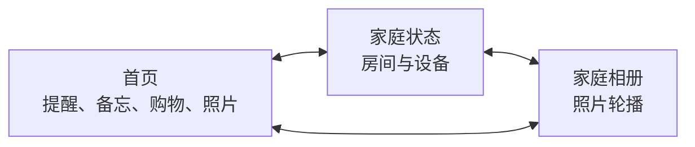

# 家庭大屏项目计划

## 项目定位

做一个竖屏家庭公告板，主要展示家庭提醒、备忘、购物清单、家庭状态和照片。

第一阶段先验证界面、NAS 后端和真实 Home Assistant 数据，不接入 ToF 和语音。

## 整体结构

### 设备职责

- NAS：运行 Home Assistant、照片存储和家庭大屏后端。
- Raspberry Pi：仅作为显示终端，通过 Chromium Kiosk 打开 NAS 提供的网页。
- 公司电脑：日常开发，使用模拟数据或远程访问家中的 Home Assistant。
- STM32 + ToF：留到后续阶段实现靠近检测和手势。
- ESP32-S3：留到后续阶段实现语音交互。

## 页面结构

## 第一阶段

目标：先做出可以在电脑和树莓派上运行的界面原型，并确定 NAS 后端的数据接口。

1. 确认三个页面的内容和顺序。
2. 根据设计稿实现 Web 页面。
3. 使用模拟数据展示内容。
4. 支持键盘、触摸或鼠标切换页面。
5. 在 1080 × 1920 竖屏上检查字号和布局。
6. 建立最小 NAS Docker 后端，提供数据和照片接口。
7. 在公司开发环境中接入家中 Home Assistant 的真实数据。

## 后续阶段

- 完善 Home Assistant 数据接入。
- 完善 NAS 家庭照片读取和轮播。
- 后续接入 STM32 + ToF 靠近检测和手势。
- 后续接入 ESP32-S3 语音。
- 部署为 Raspberry Pi 开机自启的大屏应用。

## 已确认

- 首页各模块的最终顺序和占比。
- 今日待办从 HA 家庭备忘清单中筛选日期为今天的未完成事项。
- NAS 使用群晖 DSM6，并支持 Docker Compose。
- Raspberry Pi 只负责显示 NAS 提供的网页。

## 后续配置

- 备忘和购物清单的具体维护方式。
- NAS 照片目录的组织方式和访问权限。
- 公司电脑是否能远程访问 NAS；不能时使用本地模拟照片开发。
- 家庭状态页首版需要展示哪些房间和设备。
- Home Assistant 接口和实体映射在开发联调时进一步确认。
